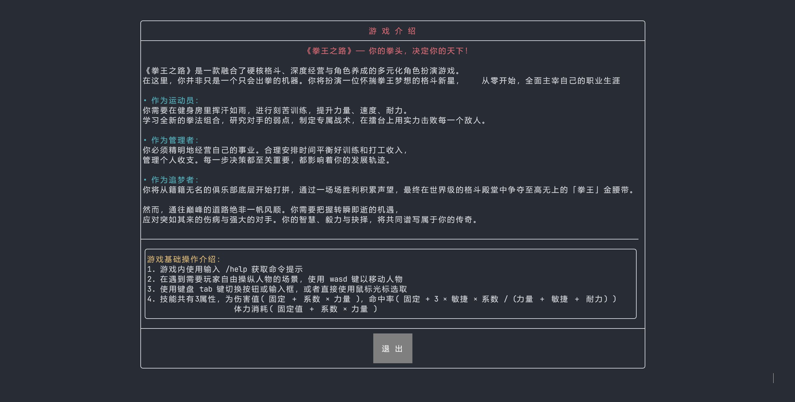
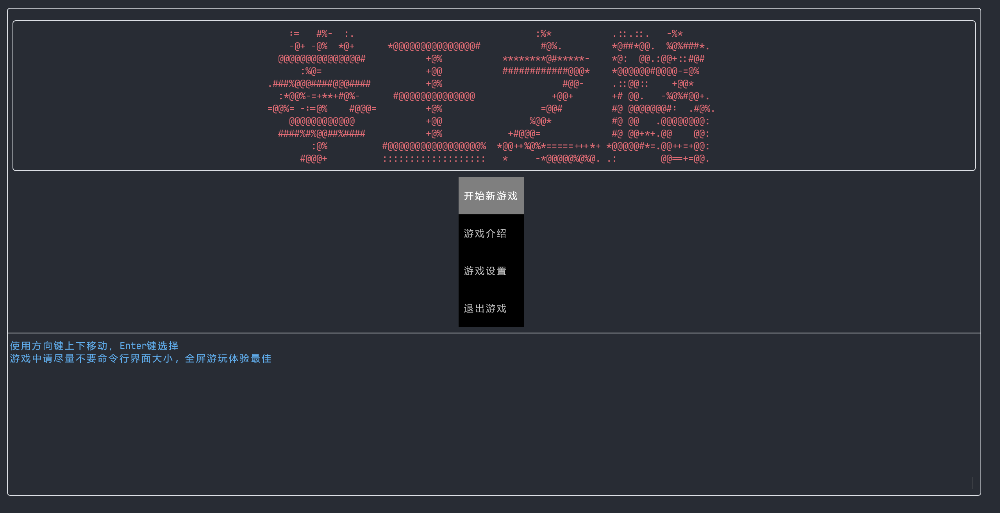
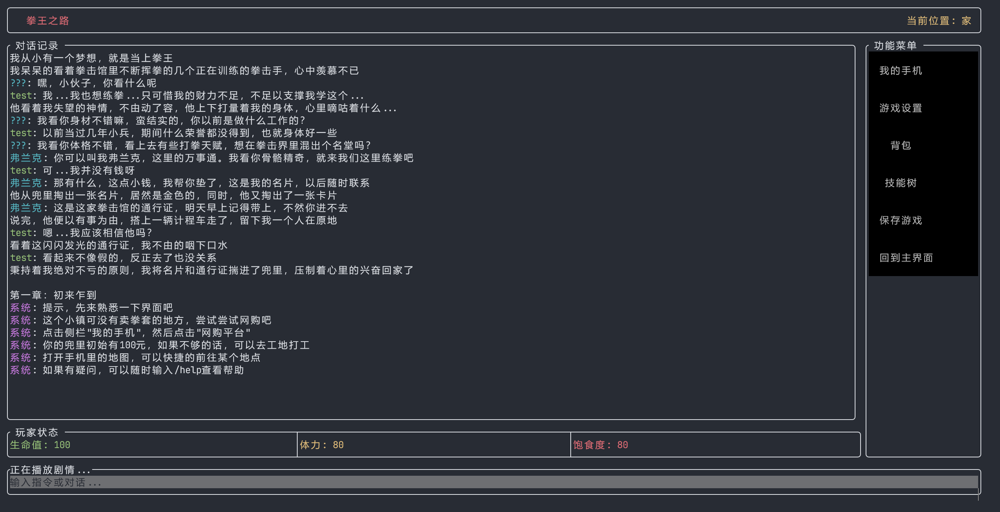
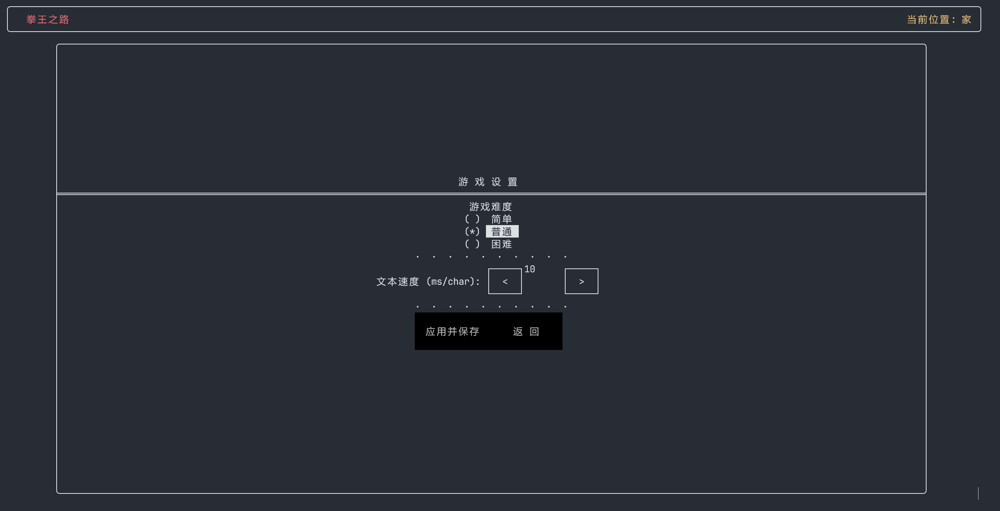
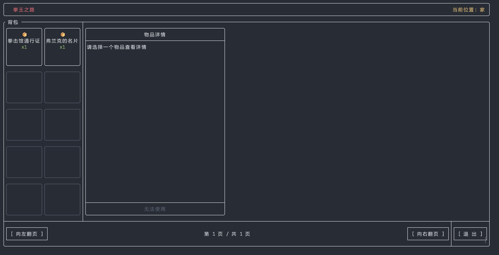
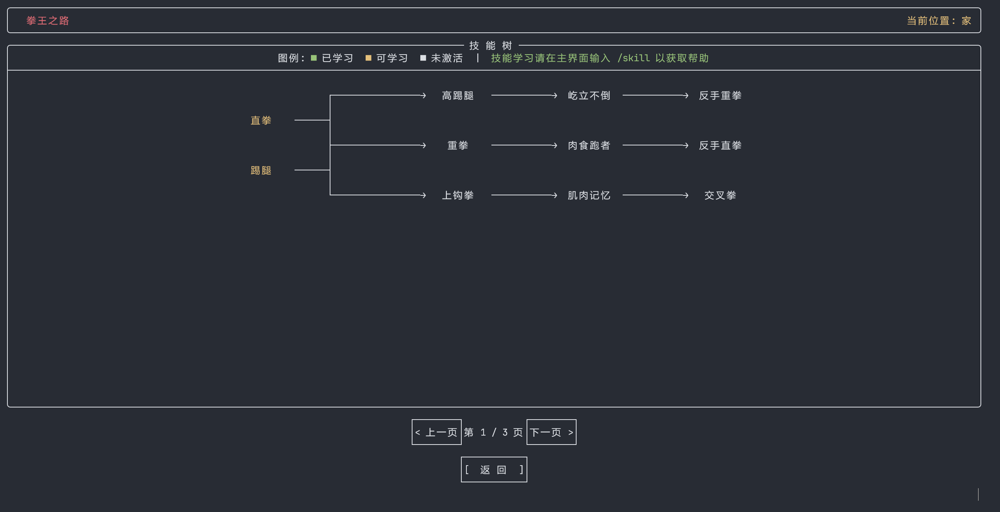
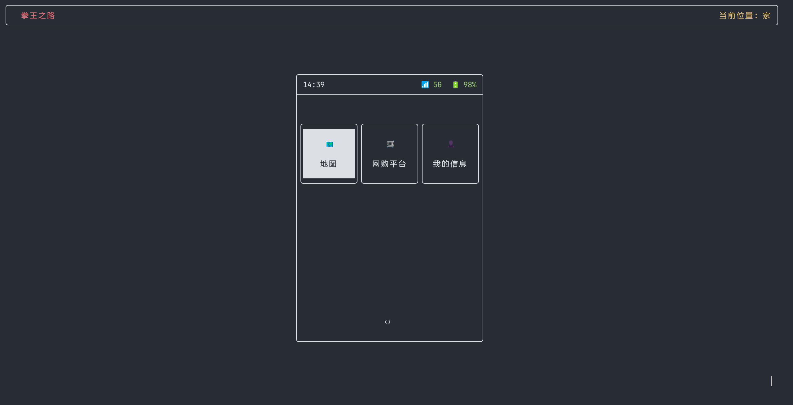
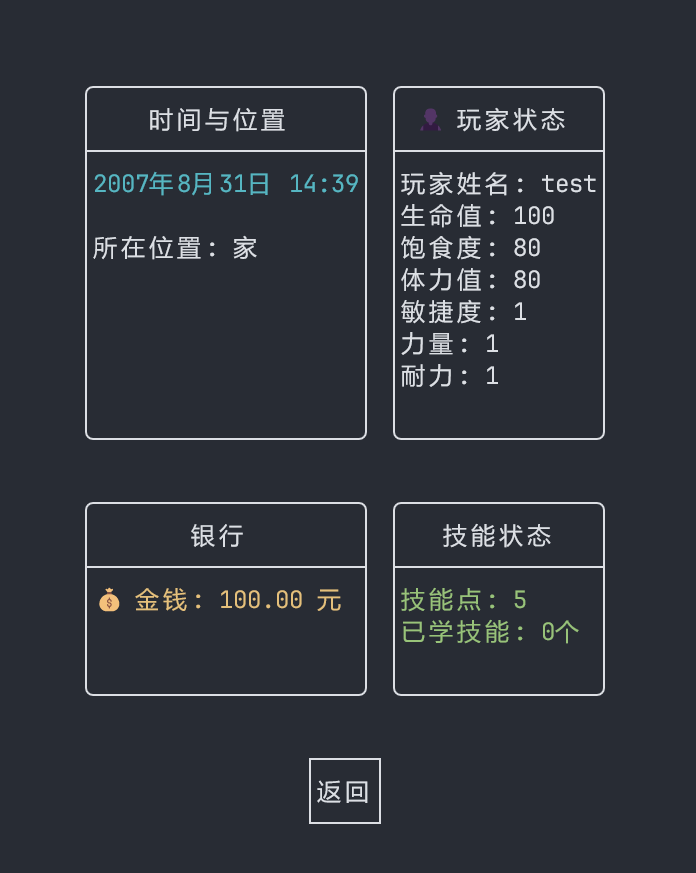
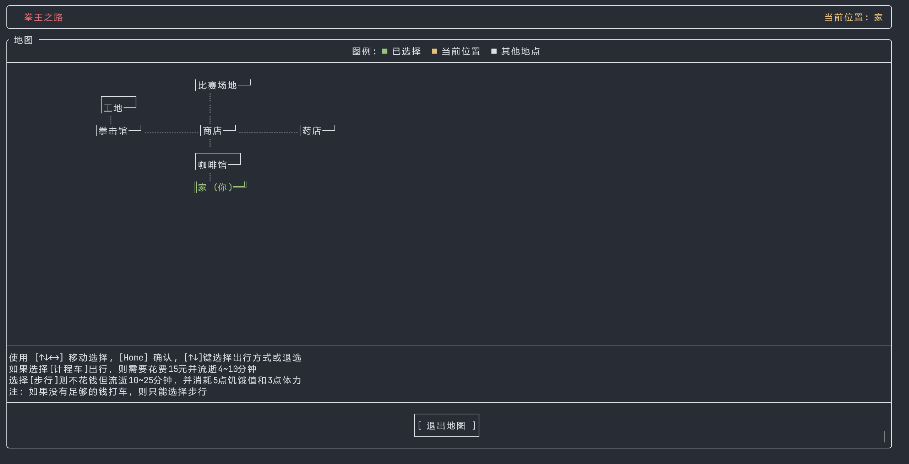

# 2025_OUC_MUDGAME

2025年程序设计基础实践-MUD游戏开发

- 游戏名：拳王之路
- 开发团队人数：5

## 实机截图 / Screenshot

更多图片

## 下载 / Release

[Release](https://github.com/Yaosanqi137/2025_OUC_MUDGAME/releases)

下载 Assets 中的 BoxingGame-*.zip。运行需要 C++ 运行库。

## 构建 / Build

### **Windows**

1. 确定自己本地有 [CMake](https://cmake.org/download/) 环境
2. 运行 `build.bat` 即可构建
3. 如果使用 CLion 等 IDE ，加载 CMake 项目后点击构建按钮即可

### **Linux**

TODO

## 待办 / TODO

- [x] 对话显示
- [x] 主界面
- [x] 游戏介绍页
- [ ] 任务系统
- [x] 背包系统
- [x] 存档及加载存档
- [ ] NPC 对话、交互
- [x] 商店、健身房、比赛场、家 等场景
- [x] 战斗系统、技能系统
- [x] 食物、药物
- [ ] 基本剧情(1~3章)
  

## 参考资料 / Reference

[实验大纲](docs\reference\程序设计基础实践-实验大纲_2025.pdf)

## 贡献者 / Contributor

## 协议 / License

[MIT License](LICENSE)
